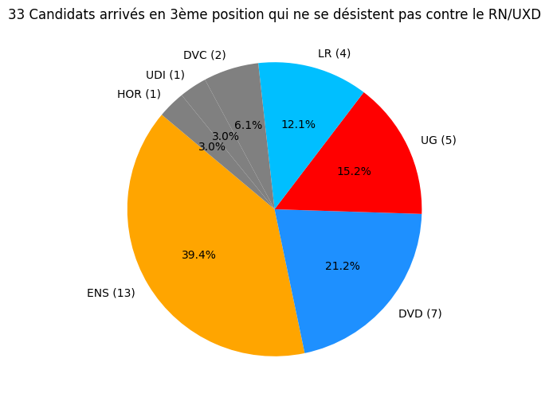

# Infographie Législative France 2024

Entre-Deux tour, cette infographie représente le nombre de candidats arrivés en troisième place lors du premier tour et ne s'étant pas désisté pour faire barrage au RN/UXD.

Source:

* [résultat du 1er tour](https://www.data.gouv.fr/en/datasets/resultats-du-1er-tour-des-elections-legislatives-2024-par-circonscription/)
* [candidats en liste pour le 2ème tour](https://www.data.gouv.fr/fr/datasets/elections-legislatives-des-30-juin-et-7-juillet-2024-liste-des-candidats-du-2nd-tour/)